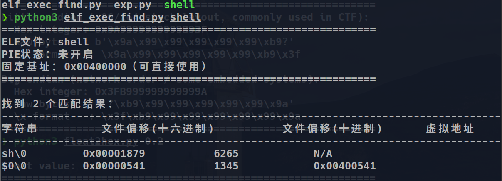
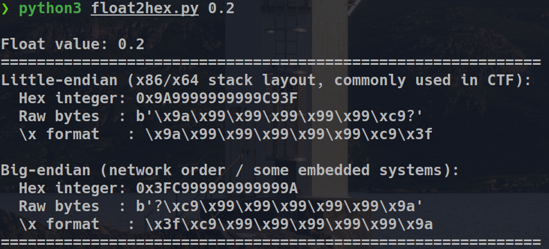

# pwn-Toolbox
In practice, continuously supplement tools and scripts related to pwn questions.

#1、elf_exec_find.py

#Check all executable parameters in the elf file such as /bin/sh\x00,$0,sh\x00, etc

#usage

python3 elf_exec_find.py [elf_file_name]

#2、float2hex.py

#Convert a floating-point number to hexadecimal data that can be seen in memory

#usage

python3 float2hex.py 0.1

